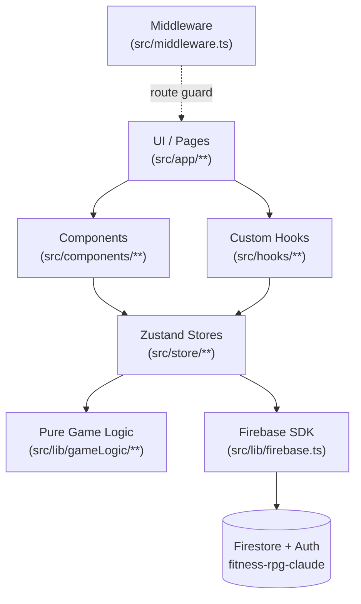
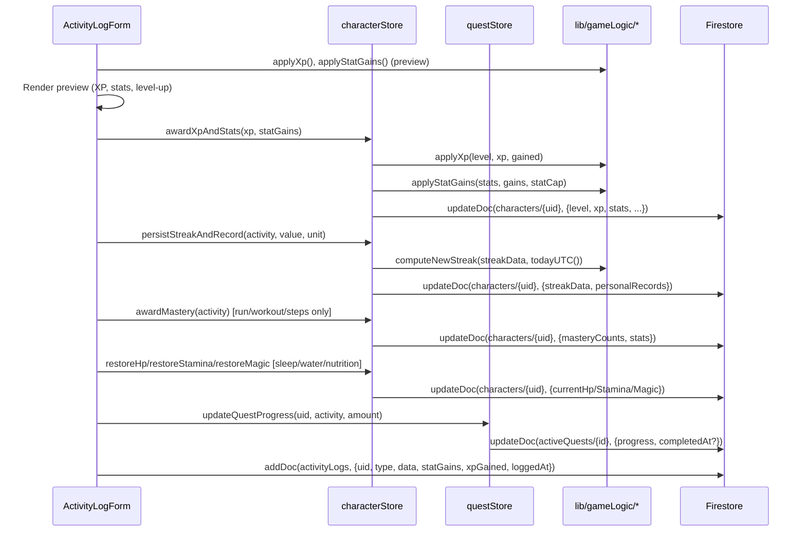

# FitQuest — Architecture

Reference for how the app is wired together. For game-design / mechanic details see [README.md](../README.md). For data-layer specifics see [FIRESTORE.md](FIRESTORE.md). For pipeline details see [CI.md](CI.md). For game-logic API see [GAME-LOGIC.md](GAME-LOGIC.md).

---

## Layered architecture

FitQuest is a single-page Next.js 14 app with a clear top-down dependency chain. Every layer below is a **producer** that the layer above consumes; nothing skips a layer (e.g. components must not call Firestore directly).

**Rules of the layout:**

- **UI never calls Firebase directly.** All reads/writes route through a Zustand store action, which uses helpers from `src/lib/`.
- **Game logic is pure and side-effect-free.** `src/lib/gameLogic/` contains deterministic functions that take inputs and return outputs — no I/O, no globals. This is what the vitest suite covers.
- **Zustand is the in-memory source of truth during a session.** Firestore is the persistence layer. Store actions reconcile the two.
- **Auth gating is enforced in two places.** Client-side via `src/middleware.ts` (redirects), server-side via Firestore rules (the only authoritative gate).

---

## Folder map (`src/`)

| Path                      | Role                                                                                                  |
| ------------------------- | ----------------------------------------------------------------------------------------------------- |
| `app/(auth)/`             | Public auth routes — login, register.                                                                 |
| `app/(game)/`             | All authenticated game pages. Behind both middleware and Firestore-rule gates.                        |
| `app/character-creation/` | One-time class-selection flow on first login.                                                         |
| `app/layout.tsx`          | Root layout, global providers, font setup.                                                            |
| `app/page.tsx`            | Landing redirect.                                                                                     |
| `components/`             | Shared UI building blocks (forms, cards, modals, bars).                                               |
| `hooks/`                  | Reusable client hooks (`useAuth`, `useCharacter`, `useRecentActivity`).                               |
| `lib/firebase.ts`         | Firebase SDK init. Reads env vars; exports `app`, `auth`, `db`. The only Firebase wiring in the repo. |
| `lib/gameLogic/`          | Pure deterministic logic — combat, spells, XP, streaks, items, monsters, quests. Unit-tested.         |
| `store/`                  | Zustand stores (`characterStore`, `inventoryStore`, `questStore`).                                    |
| `types/index.ts`          | Single source of truth for TypeScript types. Imported by every other layer.                           |
| `middleware.ts`           | Next.js middleware — checks the Firebase `__session` cookie and redirects.                            |

---

## Route reference

### Auth group — `src/app/(auth)/`

| Route       | Purpose                                                   |
| ----------- | --------------------------------------------------------- |
| `/login`    | Email/password sign-in.                                   |
| `/register` | Email/password sign-up. Sends to character creation next. |

### Game group — `src/app/(game)/`

All routes are gated by middleware redirect to `/login` if the auth cookie is missing.

| Route         | Purpose                                                                           |
| ------------- | --------------------------------------------------------------------------------- |
| `/dashboard`  | Main hub — character summary, XP bar, quick actions, recent activity feed.        |
| `/activities` | Log workouts, runs, sleep, etc. Shows preview of XP/stat gains before submission. |
| `/character`  | Stat allocation, level-up flow, subclass selection at level 10.                   |
| `/combat`     | Turn-based battle screen — attack, magic, ability rolls, spells, items, escape.   |
| `/inventory`  | Owned items, gear slots, spell loadout, combat pack of consumables.               |
| `/shop`       | Daily-rotating gear, plus permanent consumable and spell tabs.                    |
| `/quests`     | Active daily and weekly quests with progress bars and claim buttons.              |
| `/profile`    | Analytics — XP-over-time, activity breakdown, account settings.                   |
| `/stats`      | Stat detail view.                                                                 |

### Standalone — `src/app/character-creation/`

First-login flow. Picks a name and one of `warrior` / `wizard` / `rogue` and creates the `characters/{uid}` document.

---

## Middleware (`src/middleware.ts`)

Pure redirection logic — **not an authoritative auth gate**, just UX guidance.

- Reads the `__session` cookie (set client-side by Firebase Auth).
- If unauthenticated and the path matches an `AUTH_PATHS` prefix → redirect to `/login`.
- If authenticated and the path is `/login` or `/register` → redirect to `/dashboard`.
- The matcher excludes `_next/static`, `_next/image`, `favicon.ico`, and any path containing a `.` (asset requests).

Authoritative protection lives in `firestore.rules` — see [FIRESTORE.md](FIRESTORE.md).

---

## State management

Three Zustand stores, each owning one domain. Each store exposes typed actions; React components only call those actions, never Firestore.

| Store               | Owns                                                                                                                  | Persistence                                                                                                                                        |
| ------------------- | --------------------------------------------------------------------------------------------------------------------- | -------------------------------------------------------------------------------------------------------------------------------------------------- |
| `useCharacterStore` | The signed-in player's `Character` (level, XP, stats, gold, current HP/SP/MP, streak, PRs, mastery counts, subclass). | `characters/{uid}` document. Mix of immediate-write actions and "local-only" setters used during combat for live UI without Firestore round-trips. |
| `useInventoryStore` | Inventory items, equipped gear slots, spell loadout, combat pack.                                                     | `inventory/{auto-id}` documents. Equip/unequip also writes `equippedGear` on the character doc.                                                    |
| `useQuestStore`     | Active daily + weekly quests for the player.                                                                          | `activeQuests/{auto-id}` documents. Auto-rotates expired quests on fetch.                                                                          |

**Local-only actions** (`setHpLocal`, `setStaminaLocal`, `setMagicLocal`) update the in-memory state without a Firestore write — used during combat so the HP bar updates instantly between rolls. `updateCurrentHp` / `updateCurrentStamina` / `updateCurrentMagic` flush to Firestore at the end of the fight.

---

## Data flow — logging an activity

End-to-end walkthrough of what happens when the player submits an activity. This is the canonical write path; combat and quest claims follow the same UI → store → lib → Firestore shape.

The character-doc updates are not transactional with the activity log write — if the activity log fails, the character may still be updated. This is acceptable for the MVP (writes are idempotent on retry); a future hardening pass could wrap the sequence in a Firestore batch.

---

## Cross-references

- **Firestore schema, validation rules, and the security model** → [FIRESTORE.md](FIRESTORE.md)
- **CI pipeline, husky hooks, dependabot** → [CI.md](CI.md)
- **Game logic API (every exported function in `src/lib/gameLogic/`)** → [GAME-LOGIC.md](GAME-LOGIC.md)
- **Hardening checklist + remediations log** → [SECURITY-SETUP.md](SECURITY-SETUP.md)
- **Vulnerability reporting policy** → [SECURITY.md](../SECURITY.md)
- **Game mechanics, formulas, balance tables** → [README.md](../README.md)
