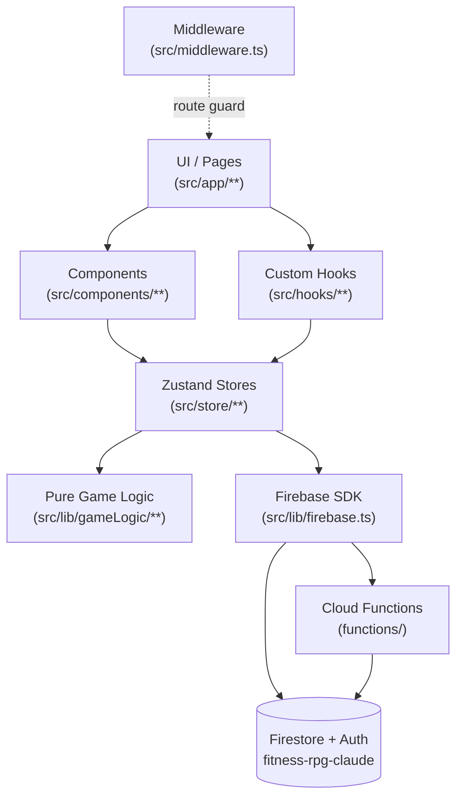
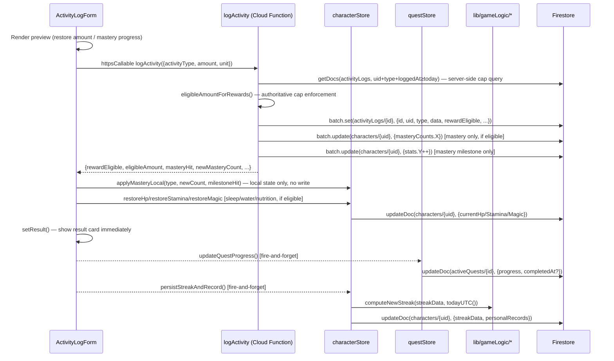
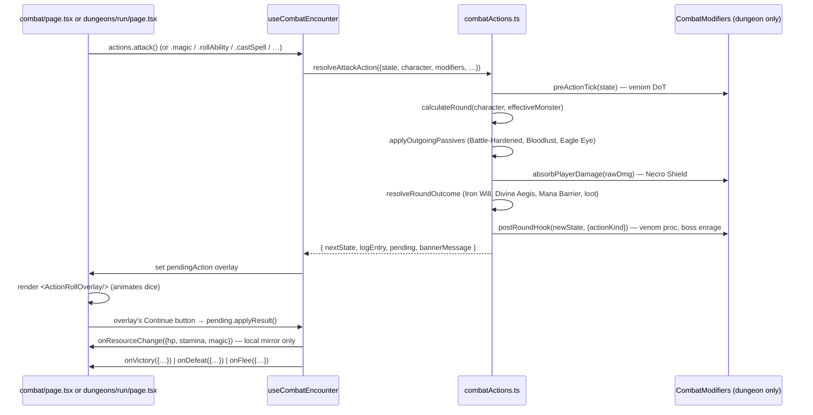
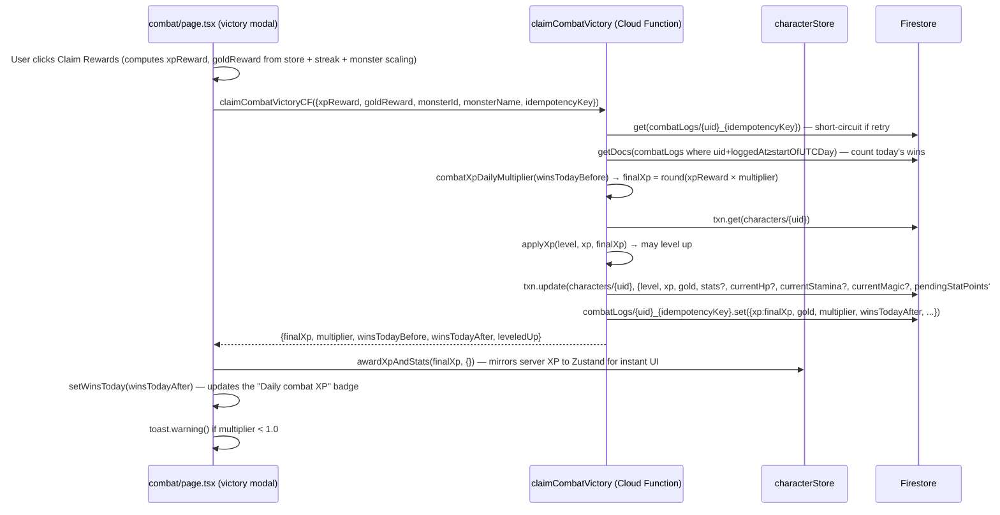

# FitQuest — Architecture

Reference for how the app is wired together. For game-design / mechanic details see [README.md](../README.md). For data-layer specifics see [FIRESTORE.md](FIRESTORE.md). For pipeline details see [CI.md](CI.md). For game-logic API see [GAME-LOGIC.md](GAME-LOGIC.md).

---

## Layered architecture

FitQuest is a single-page Next.js 15 app with a clear top-down dependency chain. Every layer below is a **producer** that the layer above consumes; nothing skips a layer (e.g. components must not call Firestore directly).

**Rules of the layout:**

- **UI never calls Firebase directly.** All reads/writes route through a Zustand store action or lib wrapper. Firestore reads → `src/lib/fetchPlayerData.ts`; Firestore domain writes → `src/lib/{characterData,activityData,questData,inventoryData,combatData}.ts`; Auth → `src/lib/auth.ts`; Cloud Functions → `src/lib/functions.ts`. No component or hook imports the Firebase SDK directly (except `useAuth`, which owns the auth-state subscription, and is the only sanctioned exception).
- **Game logic is pure and side-effect-free.** `src/lib/gameLogic/` contains deterministic functions that take inputs and return outputs — no I/O, no globals. This is what the vitest suite covers.
- **Zustand is the in-memory source of truth during a session.** Firestore is the persistence layer. Store actions reconcile the two.
- **Auth gating is enforced in two places.** Client-side via `src/middleware.ts` (redirects), server-side via Firestore rules (the only authoritative gate).

---

## Folder map (`src/`)

| Path                        | Role                                                                                                                                                                                                                                                                                                                                                                                                                                                                                                                                                                                                                                                                                                                                                                                  |
| --------------------------- | ------------------------------------------------------------------------------------------------------------------------------------------------------------------------------------------------------------------------------------------------------------------------------------------------------------------------------------------------------------------------------------------------------------------------------------------------------------------------------------------------------------------------------------------------------------------------------------------------------------------------------------------------------------------------------------------------------------------------------------------------------------------------------------- |
| `app/(auth)/`               | Public auth routes — login, register.                                                                                                                                                                                                                                                                                                                                                                                                                                                                                                                                                                                                                                                                                                                                                 |
| `app/(game)/`               | All authenticated game pages. Behind both middleware and Firestore-rule gates.                                                                                                                                                                                                                                                                                                                                                                                                                                                                                                                                                                                                                                                                                                        |
| `app/(legal)/`              | Public legal pages — `/privacy` (Privacy Policy) and `/terms` (Terms of Use). Minimal branded layout with no game nav; accessible without authentication.                                                                                                                                                                                                                                                                                                                                                                                                                                                                                                                                                                                                                             |
| `app/character-creation/`   | One-time class-selection flow on first login.                                                                                                                                                                                                                                                                                                                                                                                                                                                                                                                                                                                                                                                                                                                                         |
| `app/layout.tsx`            | Root layout, global providers, font setup.                                                                                                                                                                                                                                                                                                                                                                                                                                                                                                                                                                                                                                                                                                                                            |
| `app/page.tsx`              | Landing redirect.                                                                                                                                                                                                                                                                                                                                                                                                                                                                                                                                                                                                                                                                                                                                                                     |
| `components/`               | Shared UI building blocks (forms, cards, modals, bars). Key primitives: `Card` (variant system), `InputField` (canonical themed input — use instead of raw `<input>`), `Button`, `Modal`, `Skeleton`, `XPBar`, `GoldDisplay`, `SpellCard`, `PremiumSpellCard` (rarity shimmer wrapper for `SpellCard` — also hosts front/back flip), `SpellCardBack` (uniform MTG-style spellbook back face), `EntityArt` (heraldic-framed silhouette renderer for all game entities), `RouteBackground` (per-route gradient + SVG pattern, theme-aware), `ThemeToggle` (light/dark switch), `SoundToggle`, `InstallAppButton` / `InstallBanner` (PWA install prompt), `WelcomeBackBanner` (dismissible top banner for returning players — pairs with `useWelcomeBackBoost`), `BrandMark` (wordmark). |
| `components/art/`           | Heraldic art assets and icon sets. `silhouettes.tsx` + `item-silhouettes.tsx` — unique SVG silhouette functions for every non-spell item (~110 functions, keyed by `item.id`, after the content-scaling item drop). `stat-icons.tsx` — per-stat SVG glyphs (STR sword blade / WIS open eye / AGI wind spiral). `action-icons.tsx` — dashboard quick-action SVG icons (Activities, Combat, Quests, Shop). `HeraldicFrame.tsx` / `EntityArt.tsx` — framing and rendering layer.                                                                                                                                                                                                                                                                                                         |
| `components/combat/`        | Shared combat-UI surface — `CombatArena`, `CombatEffects`, `CombatActionBar`, `HpBar`, `LastActionSummary`, `BattleLogEntry`, `BattleResultsModal`, `MonsterCard`, `AbilityReference`, plus overlays under `components/combat/overlays/` (`ActionRollOverlay`, `DiceRollOverlay`, `SpellRollOverlay`). Shared between the arena page (`/combat`) and the dungeon run page (`/combat/dungeons/run`). `types.ts` exports `FightState`, `RoundEntry`, `PendingAction/Ability/Spell`, and `CombatModifiers` (the dungeon plug-in seam).                                                                                                                                                                                                                                                   |
| `hooks/`                    | Reusable client hooks (`useAuth`, `useCharacter`, `useGameData` (bootstraps all stores on app load), `useRecentActivity`, `useCombatBursts`, `useCombatEncounter`, `useInventoryNewMarkers`, `useTodayKey`, `useOnlineStatus`, `useInstallPrompt`, `useSound`, `useTheme`, `useHealthConnections` (subscribes to the player's `healthConnections` docs), `useCollectionAchievementSync` (mirrors collection achievements to Firestore on inventory/bestiary change), `useWelcomeBackBoost` (returns whether the player qualifies for the welcome-back session boost), `useDailyLoginBonus` (grants once-per-UTC-day gold + XP toast)). All hooks live here — none in component files.                                                                                                 |
| `lib/firebase.ts`           | Firebase SDK init. Reads env vars; exports `app`, `auth`, `db`, `functions`. Enables Firestore IndexedDB offline persistence (`persistentLocalCache` + `persistentMultipleTabManager`) with an SSR guard (`typeof window === 'undefined'` falls back to the in-memory instance) and a hot-reload guard (try/catch around `initializeFirestore` falls through to `getFirestore`). When `NEXT_PUBLIC_USE_FIREBASE_EMULATOR=true`, connects all three services to local emulators — Auth (9099), Firestore (8080), Functions (5001) — and skips IndexedDB persistence (emulator data is ephemeral). The only Firebase wiring in the repo.                                                                                                                                                |
| `lib/retry.ts`              | Generic async retry utility. Exports `fetchWithRetry<T>(fn, delaysMs, onRetry?)`, `isRetryable(error)`, and `STORE_RETRY_DELAYS = [1_000, 3_000]`. `isRetryable` fast-paths non-transient Firebase errors (permission-denied, unauthenticated, not-found, etc.) so they throw immediately without burning delay slots. All store fetch actions (`characterStore`, `inventoryStore`, `questStore` read path, `statsStore`) wrap their Firestore reads in `fetchWithRetry`.                                                                                                                                                                                                                                                                                                             |
| `lib/navConfig.ts`          | Single source of truth for navigation: exports `NAV_ITEMS` (9 items with href/label/Icon) and `ALL_NAV_HREFS` (derived). Both `layout.tsx` and `navPreferenceStore` import from here so they can never drift apart.                                                                                                                                                                                                                                                                                                                                                                                                                                                                                                                                                                   |
| `lib/gameLogic/`            | Pure deterministic logic — combat, spells, XP, streaks, items, monsters, quests. Unit-tested.                                                                                                                                                                                                                                                                                                                                                                                                                                                                                                                                                                                                                                                                                         |
| `store/`                    | Zustand stores (`characterStore`, `inventoryStore`, `questStore`, `statsStore`, `dungeonStore`, `combatStore`, `activityStore`, `navPreferenceStore`).                                                                                                                                                                                                                                                                                                                                                                                                                                                                                                                                                                                                                                |
| `types/index.ts`            | Single source of truth for TypeScript types. Imported by every other layer.                                                                                                                                                                                                                                                                                                                                                                                                                                                                                                                                                                                                                                                                                                           |
| `types/cloudFunctions.ts`   | Canonical `LogActivityInput` / `LogActivityResult` types shared between `ActivityLogForm` and `functions/`.                                                                                                                                                                                                                                                                                                                                                                                                                                                                                                                                                                                                                                                                           |
| `lib/fetchPlayerData.ts`    | Firestore fetch helpers with field-normalizing functions (`normalizeActiveQuest`, `normalizeInventoryItem`). Applies safe defaults for fields added post-MVP so raw `as` casts never silently hold `undefined`.                                                                                                                                                                                                                                                                                                                                                                                                                                                                                                                                                                       |
| `lib/characterData.ts`      | Firestore write helpers for the `characters/{uid}` document (XP, gold, HP/Stamina/Magic, streak, stats, gear).                                                                                                                                                                                                                                                                                                                                                                                                                                                                                                                                                                                                                                                                        |
| `lib/activityData.ts`       | Firestore helpers for `activityLogs/{uid}` reads (recent activity feed, per-day aggregates).                                                                                                                                                                                                                                                                                                                                                                                                                                                                                                                                                                                                                                                                                          |
| `lib/questData.ts`          | Firestore write helpers for `activeQuests/{id}` (progress updates, claim writes).                                                                                                                                                                                                                                                                                                                                                                                                                                                                                                                                                                                                                                                                                                     |
| `lib/inventoryData.ts`      | Firestore write helpers for `inventory/{id}` documents (equip/unequip, parallel gear writes).                                                                                                                                                                                                                                                                                                                                                                                                                                                                                                                                                                                                                                                                                         |
| `lib/combatData.ts`         | Firestore write helpers for `combatLogs/{id}` documents (per-day combat XP tracking).                                                                                                                                                                                                                                                                                                                                                                                                                                                                                                                                                                                                                                                                                                 |
| `lib/dungeonData.ts`        | Firestore read/write helpers for `dungeonRuns/{runId}` documents (`createDungeonRunDoc`, `getActiveDungeonRun`, `updateDungeonRunProgress`, `finalizeDungeonRun`, `getRecentDungeonRuns`).                                                                                                                                                                                                                                                                                                                                                                                                                                                                                                                                                                                            |
| `lib/errors.ts`             | Shared error types / helpers used across lib wrappers for consistent error propagation.                                                                                                                                                                                                                                                                                                                                                                                                                                                                                                                                                                                                                                                                                               |
| `lib/functions.ts`          | Cloud Functions callable wrappers (`logActivityFn`, `claimDungeonRunCF`, `claimCombatVictoryCF`). Components import from here — never instantiate `httpsCallable` directly.                                                                                                                                                                                                                                                                                                                                                                                                                                                                                                                                                                                                           |
| `lib/health.ts`             | Health-sync callable wrappers (`createStravaAuthUrl`, `createGarminAuthUrl`) + `HEALTH_SYNC_ENABLED` feature flag. Strava is the works-today free path; Garmin is gated on enterprise approval. See [HEALTH-INTEGRATION.md](HEALTH-INTEGRATION.md).                                                                                                                                                                                                                                                                                                                                                                                                                                                                                                                                   |
| `lib/healthData.ts`         | Firestore read helpers for `healthConnections/{id}` (`subscribeToHealthConnections`, normalizer). Read-only — docs are written server-side by the Strava/Garmin Cloud Functions.                                                                                                                                                                                                                                                                                                                                                                                                                                                                                                                                                                                                      |
| `lib/auth.ts`               | Firebase Auth wrappers (`signIn`, `signUp`, `logOut`). Auth pages import from here — never import Firebase Auth SDK directly.                                                                                                                                                                                                                                                                                                                                                                                                                                                                                                                                                                                                                                                         |
| `lib/refreshPlayerState.ts` | Single `refreshPlayerState(uid)` helper that force-fetches character + inventory in one call. Used after any gold-mutating operation (shop buy, dungeon claim) to reconcile local store state with Firestore truth.                                                                                                                                                                                                                                                                                                                                                                                                                                                                                                                                                                   |
| `lib/sounds.ts`             | Web Audio API sound engine. Zero bundle cost — all sounds are synthesized at runtime. Exports `playSound(id)`, `unlockAudio()`, and individual recipe functions. Sound is opt-in; `playSound` no-ops when the player has disabled it in `/profile`.                                                                                                                                                                                                                                                                                                                                                                                                                                                                                                                                   |
| `lib/confetti.ts`           | Canvas-confetti wrapper with `fireConfetti(intensity)`. Intensities: `subtle` / `medium` / `celebration` / `legendary` (gold-heavy palette, 3 staggered bursts). All presets are gated by `document.hidden` and `prefers-reduced-motion`.                                                                                                                                                                                                                                                                                                                                                                                                                                                                                                                                             |
| `lib/entityArt.ts`          | Maps game entities to art metadata. Exports `spellEffectKey(spell)` used by the spell overlay to select flash color and sound ID; frame-type helpers for `EntityArt`.                                                                                                                                                                                                                                                                                                                                                                                                                                                                                                                                                                                                                 |
| `middleware.ts`             | Next.js middleware — checks the Firebase `__session` cookie and redirects.                                                                                                                                                                                                                                                                                                                                                                                                                                                                                                                                                                                                                                                                                                            |

---

## Route reference

### Auth group — `src/app/(auth)/`

| Route       | Purpose                                                   |
| ----------- | --------------------------------------------------------- |
| `/login`    | Email/password sign-in.                                   |
| `/register` | Email/password sign-up. Sends to character creation next. |

### Game group — `src/app/(game)/`

All routes are gated by middleware redirect to `/login` if the auth cookie is missing.

| Route                       | Purpose                                                                                                                                                                                                                                                                                                                                  |
| --------------------------- | ---------------------------------------------------------------------------------------------------------------------------------------------------------------------------------------------------------------------------------------------------------------------------------------------------------------------------------------- |
| `/dashboard`                | Main hub — character summary, XP bar, quick actions, recent activity feed.                                                                                                                                                                                                                                                               |
| `/activities`               | Log workouts, runs, sleep, etc. Shows preview of XP/stat gains before submission.                                                                                                                                                                                                                                                        |
| `/character`                | Stat allocation, level-up flow, subclass selection at level 10.                                                                                                                                                                                                                                                                          |
| `/combat`                   | Turn-based battle screen with Arena \| Dungeons tab switcher. Arena: standard single-fight flow. Dungeons: multi-room dungeon lobby.                                                                                                                                                                                                     |
| `/combat/dungeons`          | Dungeon lobby — 4-tier tier cards, resume banner for active runs, run history with loot preview.                                                                                                                                                                                                                                         |
| `/combat/dungeons/[tierId]` | Tier entry screen — HP gate, legendary lockout status, room layout preview, champion slots stub, entry CTA.                                                                                                                                                                                                                              |
| `/combat/dungeons/run`      | Active dungeon run — combat rooms, stat-check rooms, rest rooms, boss fight, room transition interstitial, victory/defeat screens.                                                                                                                                                                                                       |
| `/inventory`                | Owned items, gear slots, spell loadout, combat pack of consumables.                                                                                                                                                                                                                                                                      |
| `/shop`                     | Daily-rotating gear, plus permanent consumable and spell tabs.                                                                                                                                                                                                                                                                           |
| `/quests`                   | Active daily and weekly quests with progress bars and claim buttons.                                                                                                                                                                                                                                                                     |
| `/profile`                  | Account settings and profile management. Includes Navigation settings card (opens the nav customizer modal via `useNavPreferenceStore`).                                                                                                                                                                                                 |
| `/profile/connections`      | Connected Devices — link **Strava** (OAuth2, works-today free path; also pulls Garmin/Apple Watch/Fitbit workouts the user syncs to Strava) or **Garmin** (OAuth 2.0 PKCE, gated on enterprise approval) to auto-log activity. Feature-flagged by `NEXT_PUBLIC_HEALTH_SYNC_ENABLED`. See [HEALTH-INTEGRATION.md](HEALTH-INTEGRATION.md). |
| `/stats`                    | Full analytics dashboard — XP chart (quest XP vs combat XP as stacked bars), activity breakdown, personal records, streak panel, and overview cards (quests completed, activities, gold earned, total XP, battles won). Bestiary and Collection have moved to `/collections/*`.                                                          |
| `/stats/bestiary`           | **Redirect** → `/collections/bestiary`. Preserved for backward compatibility.                                                                                                                                                                                                                                                            |
| `/stats/collection`         | **Redirect** → `/collections/collection`. Preserved for backward compatibility.                                                                                                                                                                                                                                                          |
| `/collections`              | Player catalog hub — 3-column progress summary strip (Achievements X/Y · Bestiary X/Y · Items X/Y) with deep-link chips + `CollectionsTabs` switcher. Default tab: full 30-achievement catalog with locked/unlocked states, badge portraits, and gold-earned badges.                                                                     |
| `/collections/bestiary`     | Monster compendium — card grid of `MONSTER_CATALOG` (level-sorted) + 4 dungeon bosses. Slain monsters show portrait + kill count + first-killed date from `character.monstersKilled`; undiscovered show greyed silhouettes. Boss-defeated state derives from tier-clear achievements.                                                    |
| `/collections/collection`   | Item collection — owned-vs-total grid grouped by type (sorted common→legendary) with overall completion %. Reads owned ids from the inventory store; spells render their effect-school silhouette via `spellEffectKey`.                                                                                                                  |

### Standalone — `src/app/character-creation/`

First-login flow. Picks a name and one of `warrior` / `wizard` / `rogue` and creates the `characters/{uid}` document.

---

## Middleware (`src/middleware.ts`)

Pure redirection logic — **not an authoritative auth gate**, just UX guidance. Implements secure-by-default: every route requires auth unless explicitly listed in `PUBLIC_PATHS`.

- Reads the `__session` cookie (set client-side by Firebase Auth).
- Defines `PUBLIC_PATHS = ['/login', '/register']` — the _only_ routes accessible without authentication. All other routes are automatically protected.
- If unauthenticated and the path is not in `PUBLIC_PATHS` → redirect to `/login`.
- If authenticated and the path is in `PUBLIC_PATHS` → redirect to `/dashboard` (avoid showing auth forms to logged-in users).
- The matcher excludes `_next/static`, `_next/image`, `favicon.ico`, and any path containing a `.` (asset requests).

**No AUTH_PATHS allowlist to maintain** — new game routes are automatically protected without middleware changes.

Authoritative protection lives in `firestore.rules` — see [FIRESTORE.md](FIRESTORE.md).

---

## State management

Eight Zustand stores, each owning one domain. Each store exposes typed actions; React components only call those actions, never Firestore. All store fetch actions wrap their Firestore reads in `fetchWithRetry` (see `lib/retry.ts`) — two retries with 1 s / 3 s back-off. Non-transient Firebase errors (permission-denied, unauthenticated) bypass delays entirely. All stores expose a `clear()` action called on sign-out.

| Store                   | Owns                                                                                                                                                                                                                                                                                                                 | Persistence                                                                                                                                                                                                                              |
| ----------------------- | -------------------------------------------------------------------------------------------------------------------------------------------------------------------------------------------------------------------------------------------------------------------------------------------------------------------- | ---------------------------------------------------------------------------------------------------------------------------------------------------------------------------------------------------------------------------------------- |
| `useCharacterStore`     | The signed-in player's `Character` (level, XP, stats, gold, current HP/SP/MP, streak, PRs, mastery counts, subclass).                                                                                                                                                                                                | `characters/{uid}` document. Mix of immediate-write actions and "local-only" setters used during combat for live UI without Firestore round-trips.                                                                                       |
| `useInventoryStore`     | Inventory items, equipped gear slots, spell loadout, combat pack.                                                                                                                                                                                                                                                    | `inventory/{auto-id}` documents. Equip/unequip also writes `equippedGear` on the character doc.                                                                                                                                          |
| `useQuestStore`         | Active daily + weekly quests for the player.                                                                                                                                                                                                                                                                         | `activeQuests/{auto-id}` documents. Auto-rotates expired quests on fetch. Only the `fetchActiveQuests` read is retried — conditional `addActiveQuestDoc` writes are not, because partial quest assignments cannot be safely rolled back. |
| `useStatsStore`         | Activity logs + combat logs for the stats/analytics page. 30 s TTL cache; exposes `retrying: boolean` for the amber "Retrying…" strip in the stats page UI.                                                                                                                                                          | Read-only; reads from `activityLogs` and `combatLogs` collections.                                                                                                                                                                       |
| `useDungeonStore`       | Active dungeon run state (current room, HP/SP/MP, monster, phase, loot, XP). `fetchActiveRun` detects and auto-finalizes phantom runs. `startRun` enforces HP gate + daily cap + gold check. `completeRun`/`abandonRun` guard against redundant finalization when the Cloud Function already wrote the final status. | `dungeonRuns/{runId}` documents via `src/lib/dungeonData.ts`.                                                                                                                                                                            |
| `useCombatStore`        | Single `combatActive: boolean` flag. Set by arena and dungeon run pages when a fight is in progress. Read by the layout's `CombatSafeLink` to block nav links and by combat pages to register the `beforeunload` guard. Cleared on sign-out.                                                                         | In-memory only — no Firestore persistence.                                                                                                                                                                                               |
| `useActivityStore`      | Maintains a real-time Firestore subscription for the player's 5 most recent activity logs (used by the dashboard recent-activity feed). `subscribe(uid)` is idempotent; `unsubscribe()` + `clear()` are called on sign-out.                                                                                          | Real-time listener on `activityLogs` — not persisted between sessions.                                                                                                                                                                   |
| `useNavPreferenceStore` | Mobile nav layout — `pinnedHrefs` (which 5 of 9 routes appear in the primary bar), `customizerOpen` (the drag-to-reorder modal), and `hasSeenCustomizer` (once-per-install onboarding badge flag). `onRehydrateStorage` validates hrefs against `ALL_NAV_HREFS` and backfills dropped slots from defaults.           | `localStorage` via Zustand `persist` middleware (key `fitquest:nav`). Partializes to `pinnedHrefs` + `hasSeenCustomizer` only — `customizerOpen` is transient UI state.                                                                  |

**Local-only actions** (`setHpLocal`, `setStaminaLocal`, `setMagicLocal`) update the in-memory state without a Firestore write — used during combat so the HP bar updates instantly between rolls. `updateCurrentHp` / `updateCurrentStamina` / `updateCurrentMagic` flush to Firestore at the end of the fight.

---

## Data flow — logging an activity

End-to-end walkthrough of what happens when the player submits an activity. The `logActivity` Cloud Function owns the authoritative write path; the client handles display and secondary writes.

**Key properties of this design:**

- **Atomic server writes.** The `activityLog` doc, mastery count, and any milestone stat increment are committed in a single Firestore batch by the Cloud Function — they either all land or none do.
- **Cap is non-bypassable.** The aggregate query runs server-side; a forged client can't skip it.
- **Result card is immediate.** `setResult()` fires as soon as the function responds. Quest-progress and streak writes are fire-and-forget — a Firestore hiccup there doesn't block the player from seeing their reward.
- **Local state stays consistent.** `applyMasteryLocal` mirrors the function's write to the Zustand store with zero extra Firestore reads. Both use `Math.min(stat + 1, statCap(linkedStat, level))`.
- **Restore writes are server-side (R4-StageC).** The function computes the formula-derived max (`playerMaxHp/Stamina/Magic`) using a minimal gear-stat lookup in `functions/src/gameLogic/combat.ts` and writes `currentHp/Stamina/Magic` atomically with the activity log. The client receives `restored.newValue` and mirrors it to Zustand via `applyRestoreLocal` — no client Firestore write occurs.
- **Shared write core.** The steps above (cap query → log write → mastery → restore → achievements) live in `functions/src/logActivityCore.ts`. The `logActivity` callable is a thin auth + validation wrapper over it, and the `garminWebhook` HTTP function (device sync) calls the **same** core — so a Garmin-synced run and a hand-typed one are byte-for-byte equivalent downstream. See [HEALTH-INTEGRATION.md](HEALTH-INTEGRATION.md) for the Garmin ingestion path.

---

## Data flow — combat round (arena or dungeon)

Every combat action (attack, magic, roll ability, cast spell, rest, meditate, use item, flee) flows through the same shared pipeline. The arena page and the dungeon run page differ only in (a) the modifiers they pass and (b) what they do when the encounter ends.

**Key properties of this design:**

- **Pure resolvers.** `src/lib/gameLogic/combatActions.ts` exports `resolveAttackAction` / `resolveAbilityAction` / `resolveSpellAction` / `resolveMeditateAction` / `resolveRestAction` / `resolveFleeAction` / `resolveUseItemAction` — no React, no Firestore. Faithful inline-extract of the legacy arena handlers.
- **Modifier seam.** `CombatModifiers` (`src/components/combat/types.ts`) hooks fire at four fixed slots: `preActionTick` → `effectiveMonster` → `absorbPlayerDamage` → `postRoundHook`. Arena passes `undefined`, every hook short-circuits to identity. Dungeon passes a memoised modifier that delegates to the unchanged helpers in `src/lib/gameLogic/dungeons.ts` (`checkVenomProc`, `bossEffectiveAtk`, `applyNecroShield`, `evaluateBossEnrage`, `dragonIgnoresDef`).
- **`onResourceChange` is a local mirror, never a persistence hook.** The hook calls it on every applied result so the page can update an in-memory Zustand slice (arena) or per-room view state (dungeon). Firestore writes happen exactly once per encounter inside `onVictory` / `onDefeat` / `onFlee`. Per-round writes would burn Firestore quota.
- **`useCombatEncounter` never calls a Cloud Function.** Arena's `onVictory` calls `claimCombatVictoryCF`; dungeon's `onVictory` calls `advanceRoom(...)` (and the boss-victory screen later calls `claimDungeonRunCF`). The hook is store-agnostic — both wirings live in the page callbacks.
- **Boss rooms hide Flee via `modifiers.fleeDisabled = true`.** `CombatActionBar` reads the modifier flag and stretches Use Item to fill the row.

---

## Data flow — claiming a combat victory

End-to-end walkthrough of what happens when the player clicks "Claim rewards" on the victory modal. The `claimCombatVictory` Cloud Function (P0-3) owns the authoritative XP/gold award path — the client never writes the combat log doc or the character XP directly.

**Key properties of this design:**

- **Server-authoritative cap.** The diminishing-returns multiplier (`1.0 → 0.5 → 0.25 → 0.1` at 10 / 20 / 30 wins) is applied inside the CF. A forged client cannot fake the win count because it doesn't control the documents being counted.
- **Idempotent retries.** The combat log doc id is `${uid}_${idempotencyKey}` where the key is a client-generated UUID. A retry hits the same doc id; the CF detects it and returns the previously-awarded amounts instead of double-awarding.
- **Gold is not capped.** Only XP is diminished — gold flows through at full value. This preserves combat as a viable gold sink for quest rerolls and dungeon entry fees while removing the XP grind incentive.
- **Atomic character write.** Level-up bookkeeping (stats, resource refill, `pendingStatPoints`) happens inside a Firestore transaction with the XP/gold update. Combat log write is post-transaction (no character-write contention) and idempotent.
- **Parity-tested multiplier.** `combatXpDailyMultiplier` is duplicated in `functions/src/gameLogic/combat.ts` (the CF can't import `@/` aliases). A parity test in `functions/src/__tests__/combatXp.test.ts` cross-checks the client and server copies for 0–100 wins.

---

## Cross-references

- **Firestore schema, validation rules, and the security model** → [FIRESTORE.md](FIRESTORE.md)
- **CI pipeline, husky hooks, dependabot** → [CI.md](CI.md)
- **Game logic API (every exported function in `src/lib/gameLogic/`)** → [GAME-LOGIC.md](GAME-LOGIC.md)
- **Hardening checklist + remediations log** → [SECURITY-SETUP.md](SECURITY-SETUP.md)
- **Vulnerability reporting policy** → [SECURITY.md](../SECURITY.md)
- **Game mechanics, formulas, balance tables** → [README.md](../README.md)
